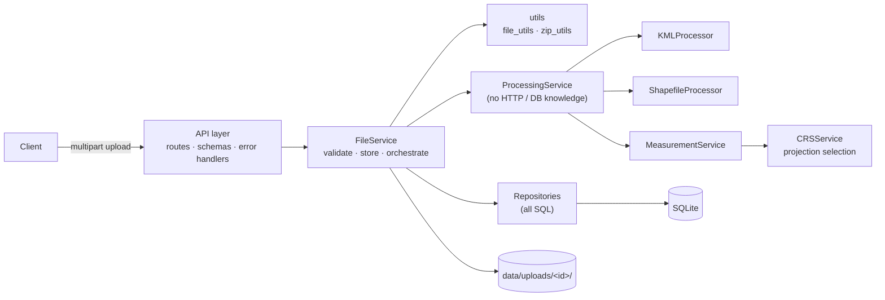

# Geospatial File Measurement API

A FastAPI service that accepts **KML** files and **zipped Shapefiles**, extracts their
features, and returns **CRS-correct area, perimeter and length measurements in metres**.

```bash
curl -F "file=@samples/bengaluru_survey.kml" http://localhost:8000/api/files/
curl http://localhost:8000/api/files/<id>/measurements/
```

---

## Table of contents

- [Overview](#overview)
- [Problem Statement](#problem-statement)
- [Features](#features)
- [Technology Stack](#technology-stack)
- [Architecture](#architecture)
- [Project Structure](#project-structure)
- [How It Works](#how-it-works)
- [API Documentation](#api-documentation)
- [Local Setup](#local-setup)
- [Running Tests](#running-tests)
- [Docker Setup](#docker-setup)
- [Example Usage](#example-usage)
- [CRS Strategy](#crs-strategy)
- [Design Decisions](#design-decisions)
- [Trade-offs](#trade-offs)
- [Future Improvements](#future-improvements)
- [Testing](#testing)
- [Assignment Notes](#assignment-notes)

---

## Overview

Upload a geospatial file and the service:

1. validates it as untrusted input (type, size, archive safety, XML safety);
2. parses every feature into one format-independent model (index, source id, geometry
   type, GeoJSON geometry, CRS, properties);
3. measures each feature in a projection chosen **for that feature's location**,
   never in raw latitude/longitude degrees;
4. stores the file record, features and measurements, and exposes them through a small
   REST API with OpenAPI docs at `/docs` and `/redoc`.

Problematic features never crash an upload. Each feature carries a measurement
**status** that explains whether it was measured and, if not, why.

## Problem Statement

Build a backend service (Django or FastAPI) that accepts a Shapefile (`.zip`) or KML,
extracts each feature's ID, geometry type, geometry, CRS and properties, and calculates
**area for polygons** and **length for lines** (points need no measurement). Geographic
coordinates (e.g. EPSG:4326) must be transformed to an appropriate projected CRS before
measuring. Required endpoints: `POST /api/files/`, `GET /api/files/{id}/`,
`GET /api/files/{id}/measurements/`.

## Features

- **Formats:** `.kml` (KML 2.0/2.1/2.2, with or without namespace) and `.zip` containing one Shapefile (`.shp` + `.shx` + `.dbf`, optional `.prj`/`.cpg`, nested folders allowed).
- **Measurements:**
  - Polygon / MultiPolygon → area (m²) and perimeter (m; the length of every ring, holes included).
  - LineString / MultiLineString → length (m).
  - Point / MultiPoint → `NOT_APPLICABLE`.
- **CRS handling per feature:**
  - The file's own projected CRS is used only if it is accurate where the feature is; otherwise the feature is measured in the local UTM zone.
  - Very large or polar features use an equal-area projection for area and geodesic lengths.
  - Features that can't be measured reliably are rejected with a reason (antimeridian crossings, mislabelled coordinates).
- **Graceful degradation:** one malformed, invalid or unsupported feature never fails the whole file.
- **Attribute preservation:** Shapefile attributes are converted to JSON types, and KML `ExtendedData` (`Data` and `SchemaData`) is kept, along with name, description and folder path.
- **Upload security:**
  - zip-slip, symlink, encrypted-member and zip-bomb protection;
  - XXE / entity-expansion protection for KML;
  - size limits enforced *while streaming*;
  - magic-byte checks, and uploaded filenames are never used as paths.
- **Consistent JSON errors** (`{"error": {"code", "message", "details"}}`) with no stack traces or server paths.
- **Operational basics:** structured `key=value` logs, `X-Request-ID` header, `/health`, non-root Docker image with a healthcheck.
- **191 automated tests.** Measurement accuracy is checked against an independent ellipsoidal ground truth.

## Technology Stack

| Concern | Choice |
|---|---|
| Language | Python 3.12 |
| Web framework | FastAPI + Uvicorn, Pydantic v2, pydantic-settings |
| Geospatial | Shapely 2 (geometry), pyproj (CRS, transformations, geodesics), GeoPandas + pyogrio/GDAL (Shapefile I/O), defusedxml (KML) |
| Persistence | SQLAlchemy 2 (ORM), SQLite |
| Testing / quality | pytest, httpx2 (Starlette TestClient), Ruff |
| Packaging | Docker (python:3.12-slim, non-root), docker compose |

## Architecture



| Layer | Responsibility |
|---|---|
| `api/` | Thin route handlers, dependency wiring, ORM→schema mapping. No business logic or SQL. |
| `services/file_service.py` | Upload lifecycle and status transitions (`UPLOADED → PROCESSING → COMPLETED/FAILED`). |
| `services/processing_service.py` | Pure pipeline: *parse → resolve CRS → measure*. Takes a file path and returns a result, so it can move to a background worker unchanged. |
| `processors/` | One class per format, all producing the same `ParsedDataset`/`ParsedFeature` model. |
| `services/crs_service.py`, `measurement_service.py` | CRS parsing, projection selection, per-feature measurement and status. |
| `db/` | Models and repositories; the only place that knows about SQL. |

## Project Structure

```
app/
├── main.py                    # app factory, middleware, exception handlers
├── api/
│   ├── deps.py                # DI: session, FileService, pagination
│   ├── serializers.py         # ORM -> response schemas
│   └── routes/
│       ├── files.py           # POST/GET files, GET features
│       └── measurements.py    # GET measurements
├── core/
│   ├── config.py              # Settings (GEO_* env vars)
│   ├── enums.py               # FileStatus, MeasurementStatus, MeasurementMethod, ...
│   ├── exceptions.py          # AppError hierarchy -> HTTP status + error code
│   ├── logging.py             # key=value log formatter
│   └── middleware.py          # streaming body-size limit, request logging
├── db/
│   ├── database.py            # engine / session factory
│   ├── models.py              # GeoFile, Feature, Measurement
│   └── repositories.py        # all queries
├── processors/
│   ├── base.py                # ParsedFeature / ParsedDataset / GeospatialProcessor
│   ├── kml_processor.py
│   └── shapefile_processor.py
├── schemas/                   # Pydantic request/response models
├── services/
│   ├── crs_service.py
│   ├── file_service.py
│   ├── measurement_service.py
│   └── processing_service.py
└── utils/
    ├── file_utils.py          # filename sanitising, type detection, streaming save
    ├── geometry_utils.py      # geometry classification, GeoJSON / JSON-safe values
    └── zip_utils.py           # safe archive inspection & extraction
tests/
├── factories.py               # builds KML / Shapefile ZIP fixtures on the fly
├── unit/                      # 145 tests
└── integration/               # 46 API and concurrency tests
samples/                       # ready-to-upload example files
scripts/generate_samples.py    # regenerates samples/
Dockerfile · docker-compose.yml · requirements*.txt · pyproject.toml · .env.example
```

## How It Works

### Upload Flow

1. **Transport limit.** `MaxBodySizeMiddleware` rejects a request whose `Content-Length` exceeds the limit, and cuts off streamed bodies once they pass it. This happens *before* Starlette spools the upload to disk → `413`.
2. **Request validation**, done before anything is persisted, so a failure leaves no record and no file:
   - the filename is sanitised for display only, and the type is detected from the extension;
   - the optional `assumed_crs` is parsed → `400`.
3. **Storage.** The file is streamed in 1 MB chunks to `data/uploads/<uuid>/source.kml|zip` with a second size check. The path comes only from a server-generated UUID.
4. **Content checks.** Magic bytes must match the extension (ZIP signature / XML). For ZIPs, the archive structure is inspected *without extracting* (see [security](#design-decisions)) → `400`.
5. A `GeoFile` row is created with status `UPLOADED`, then processing runs synchronously (`PROCESSING`).
6. **Outcome:**
   - success → `COMPLETED` → `201 Created` with a `Location` header;
   - content that can't be processed (malformed KML, unreadable `.shp`, invalid `.prj`) → the record is marked `FAILED` with an `error_message`, and the response is `422` with `error.details.file_id`, so the failure can still be inspected via `GET /api/files/{id}/`.

### Geospatial Processing Flow

```
stored file ─► processor.parse() ─► ParsedDataset(crs, features[], warnings[])
                                          │
                       resolve CRS (file CRS wins; assumed_crs only fills a gap)
                                          │
                       for each feature: MeasurementService.measure()
                                          │
                    persist Feature (GeoJSON + properties + status) + Measurement rows
```

- **KML:** parsed with `defusedxml`. Placemarks are collected recursively through `Document`/`Folder`, and each feature records its folder path.
  - Supported geometries: `Point`, `LineString`, `LinearRing`, `Polygon` (with holes) and `MultiGeometry`. A `MultiGeometry` becomes a Multi* type when homogeneous and a `GeometryCollection` otherwise.
  - `Model` and `gx:Track` are flagged as unsupported rather than dropped.
  - A malformed coordinate affects only its own feature.
  - CRS is EPSG:4326 by definition of the KML spec.
- **Shapefile:** the ZIP is safely extracted to a private temp directory using fixed names (`layer.shp`, ...) and read with GeoPandas/pyogrio.
  - The CRS is parsed from `.prj` with pyproj, which distinguishes a **missing** CRS (file completes; features become `UNKNOWN_CRS`; a warning suggests `assumed_crs`) from an **invalid** one (file `FAILED`, `422 INVALID_CRS`).
  - Attribute values (NaN, dates, numpy types) are converted to JSON.

### Measurement Flow

For each feature, the first matching rule decides its status:

| Check | Status |
|---|---|
| Geometry could not be decoded | `INVALID_GEOMETRY` (with parser message) |
| No geometry / empty geometry | `EMPTY_GEOMETRY` |
| Declared but unsupported type (e.g. KML `Model`, `gx:Track`) | `UNSUPPORTED_GEOMETRY` |
| Point / MultiPoint | `NOT_APPLICABLE` |
| GeometryCollection (mixed dimensions) | `UNSUPPORTED_GEOMETRY` |
| `shapely` reports invalid (e.g. self-intersection) | `INVALID_GEOMETRY` (with `is_valid_reason`) |
| File CRS unknown | `UNKNOWN_CRS` |
| Antimeridian crossing / out-of-range coordinates | `FAILED` (with reason) |
| Otherwise | `MEASURED` |

Measured polygons get `area` (m²) and `perimeter` (m); lines get `length` (m). Every
value records the **method** and the **CRS it was computed in**. Z values are ignored
(planimetric measurement). Values are rounded to millimetre precision.

### CRS Handling

Summarised here, explained in full under [CRS Strategy](#crs-strategy):

1. Detect the CRS (KML: EPSG:4326; Shapefile: `.prj`; optional `assumed_crs` fallback).
2. Use only the horizontal component (compound CRSs such as `EPSG:4326+5773` are handled).
3. Choose a measurement CRS per feature, preserve the original CRS on the file and
   features, and report both in the measurement output.

## API Documentation

Interactive docs: **http://localhost:8000/docs** (Swagger UI) and **/redoc**.

Paths end with a slash, as in the assignment (`/api/files/`). A request without it gets a
`307` redirect to the canonical path; with curl, use the trailing slash (or `-L`).

All errors use one envelope:

```json
{ "error": { "code": "INVALID_ARCHIVE", "message": "Shapefile 'roads' is missing required component(s): .dbf.", "details": {} } }
```

| Code | HTTP | When |
|---|---|---|
| `UNSUPPORTED_FILE_TYPE` | 400 | Extension is not `.kml` / `.zip` |
| `INVALID_UPLOAD` | 400 | Empty file, or content doesn't match extension |
| `INVALID_ARCHIVE` | 400 | Not a ZIP, unsafe paths, symlinks, encryption, zip bomb, no / multiple / incomplete shapefiles |
| `INVALID_CRS` | 400 / 422 | Unparseable `assumed_crs` (400); invalid `.prj` content (422) |
| `NOT_FOUND` | 404 | Unknown file id |
| `FILE_NOT_PROCESSED` | 409 | Features/measurements requested for a file that is not `COMPLETED` |
| `FILE_TOO_LARGE` | 413 | Upload exceeds `GEO_MAX_UPLOAD_BYTES` (default 50 MB) |
| `PROCESSING_FAILED` | 422 | File accepted but content unprocessable (`details.file_id` → FAILED record) |
| `VALIDATION_ERROR` | 422 | Missing form field, bad query parameter |
| `INTERNAL_ERROR` | 500 | Unexpected error (details logged server-side only) |

### `POST /api/files/` — upload and process

- **Request:** `multipart/form-data`
  - `file` (required): `.kml`, or `.zip` containing exactly one Shapefile.
  - `assumed_crs` (optional): e.g. `EPSG:4326`, any pyproj-readable value. Used **only** if the file declares no CRS; a conflicting value is ignored with a warning.
- **Response:** `201 Created`, `Location: /api/files/{id}/`

```bash
curl -F "file=@samples/bengaluru_survey.kml" http://localhost:8000/api/files/
```

```json
{
  "id": "8627ad32a050459fa35736d101ed51bb",
  "filename": "bengaluru_survey.kml",
  "file_type": "KML",
  "size_bytes": 1371,
  "status": "COMPLETED",
  "feature_count": 4,
  "crs": "EPSG:4326",
  "crs_name": "WGS 84",
  "warnings": [],
  "error_message": null,
  "processing_time_ms": 59,
  "created_at": "2026-10-07T10:50:53.469038Z",
  "processed_at": "2026-10-07T10:50:53.545182Z",
  "links": {
    "self": "/api/files/8627ad32a050459fa35736d101ed51bb/",
    "features": "/api/files/8627ad32a050459fa35736d101ed51bb/features/",
    "measurements": "/api/files/8627ad32a050459fa35736d101ed51bb/measurements/"
  }
}
```

- **Errors:** 400, 413, 422 (see table).

### `GET /api/files/{id}/` — file information

Returns the same shape as the upload response; works for `FAILED` files too
(`status: "FAILED"`, `error_message` set). **Errors:** 404.

```bash
curl http://localhost:8000/api/files/8627ad32a050459fa35736d101ed51bb/
```

### `GET /api/files/{id}/measurements/` — measurements

- **Query:** `limit` (1–1000, default 100), `offset` (≥ 0).
- `summary` always covers the **whole file**; `items` is the requested page.
- **Errors:** 404, 409 (file not `COMPLETED`), 422 (bad pagination).

```bash
curl "http://localhost:8000/api/files/8627ad32a050459fa35736d101ed51bb/measurements/"
```

```json
{
  "total": 4, "limit": 100, "offset": 0,
  "file_id": "8627ad32a050459fa35736d101ed51bb",
  "source_crs": "EPSG:4326",
  "summary": {
    "feature_count": 4,
    "status_counts": { "MEASURED": 3, "NOT_APPLICABLE": 1, "UNSUPPORTED_GEOMETRY": 0, "INVALID_GEOMETRY": 0, "EMPTY_GEOMETRY": 0, "UNKNOWN_CRS": 0, "FAILED": 0 },
    "total_area_m2": 1712472.239,
    "total_length_m": 1307.412
  },
  "items": [
    {
      "feature_index": 0, "source_id": "lalbagh", "geometry_type": "Polygon",
      "status": "MEASURED", "message": null,
      "measurements": [
        { "type": "area", "value": 847260.471, "unit": "m²", "method": "UTM", "measurement_crs": "EPSG:32643" },
        { "type": "perimeter", "value": 3560.337, "unit": "m", "method": "UTM", "measurement_crs": "EPSG:32643" }
      ]
    },
    {
      "feature_index": 2, "source_id": "mg-road", "geometry_type": "LineString",
      "status": "MEASURED", "message": null,
      "measurements": [
        { "type": "length", "value": 1307.412, "unit": "m", "method": "UTM", "measurement_crs": "EPSG:32643" }
      ]
    },
    {
      "feature_index": 3, "source_id": "survey-marker", "geometry_type": "Point",
      "status": "NOT_APPLICABLE", "message": "Points have no area or length.", "measurements": []
    }
  ]
}
```

*(Item 1, Cubbon Park, omitted for brevity.)* `method` is one of `SOURCE_PROJECTED`,
`UTM`, `LOCAL_EQUAL_AREA`, `GEODESIC`. `status` is one of `MEASURED`,
`NOT_APPLICABLE`, `UNSUPPORTED_GEOMETRY`, `INVALID_GEOMETRY`, `EMPTY_GEOMETRY`,
`UNKNOWN_CRS`, `FAILED`.

### `GET /api/files/{id}/features/` — extracted features

Exposes everything the assignment requires per feature: index, source id, geometry
type, geometry (GeoJSON, **in the source CRS**), CRS, and properties. Paginated like
measurements. **Errors:** 404, 409, 422.

```bash
curl "http://localhost:8000/api/files/8627ad32a050459fa35736d101ed51bb/features/?limit=1"
```

```json
{
  "total": 4, "limit": 1, "offset": 0,
  "file_id": "8627ad32a050459fa35736d101ed51bb", "crs": "EPSG:4326",
  "items": [{
    "index": 0, "source_id": "lalbagh", "geometry_type": "Polygon",
    "geometry": { "type": "Polygon", "coordinates": [[[77.58, 12.953], [77.589, 12.953], [77.5905, 12.948], [77.585, 12.9445], [77.5795, 12.9475], [77.58, 12.953]]] },
    "crs": "EPSG:4326",
    "properties": { "name": "Lalbagh Botanical Garden", "folder": "Bengaluru survey/Parks", "category": "botanical garden", "surveyed_by": "Team A" }
  }]
}
```

### `GET /api/files/` — list uploads

Newest first, paginated (`limit`, `offset`). `GET /health` returns `{"status": "ok"}`.

## Local Setup

Requires **Python 3.12+**. No GDAL/GEOS/PROJ system install is needed: the wheels bundle them.

macOS / Linux:

```bash
git clone https://github.com/code-with-vishnu26/geospatial-measurement-api.git geospatial-measurement-api
cd geospatial-measurement-api
python3.12 -m venv .venv
source .venv/bin/activate
pip install -r requirements-dev.txt          # or requirements.txt for runtime only
cp .env.example .env                         # optional; defaults work as-is
uvicorn app.main:create_app --factory --reload
```

Windows (PowerShell):

```powershell
git clone https://github.com/code-with-vishnu26/geospatial-measurement-api.git geospatial-measurement-api
cd geospatial-measurement-api
py -3.12 -m venv .venv
.venv\Scripts\Activate.ps1
pip install -r requirements-dev.txt
uvicorn app.main:create_app --factory --reload
```

Open http://localhost:8000/docs. Uploads and the SQLite database are written to `./data/`
(configurable through `GEO_DATA_DIR`). All settings are listed in [.env.example](.env.example).

## Running Tests

```bash
pip install -r requirements-dev.txt
pytest                      # 191 tests, ~11 s
pytest tests/unit           # 145 unit tests
pytest tests/integration    # 46 API and concurrency tests
ruff check . && ruff format --check .
```

Tests generate their own KML and Shapefile fixtures in temporary directories. They need
no network, external services or checked-in binaries.

## Docker Setup

```bash
docker build -t geospatial-measurement-api .
docker run --rm -p 8000:8000 -v geo-data:/app/data geospatial-measurement-api
```

Or with compose (named volume for data, optional `.env` overrides):

```bash
docker compose up --build
```

About the image:

- based on `python:3.12-slim` and runs as the unprivileged user `appuser` (uid 10001);
- includes a `HEALTHCHECK` against `/health`, and data lives in the `/app/data` volume;
- needs no system geospatial packages, since GDAL, GEOS and PROJ come from the Python wheels.

## Example Usage

Ready-made files are in [`samples/`](samples/), all located in Bengaluru. Regenerate them with
`python scripts/generate_samples.py`.

```bash
# 1. KML (polygons, a line and a point; WGS 84)
curl -F "file=@samples/bengaluru_survey.kml" http://localhost:8000/api/files/

# 2. Shapefile ZIP in WGS 84 -> measured in UTM 43N
curl -F "file=@samples/bengaluru_parks_wgs84.zip" http://localhost:8000/api/files/

# 3. The same parks as a Shapefile already in UTM 43N -> measured natively
curl -F "file=@samples/bengaluru_parks_utm43n.zip" http://localhost:8000/api/files/

# 4. A Shapefile without .prj: tell the service which CRS to assume
curl -F "file=@parcels_without_prj.zip" -F "assumed_crs=EPSG:4326" http://localhost:8000/api/files/

# File details, features and measurements
curl http://localhost:8000/api/files/<id>/
curl "http://localhost:8000/api/files/<id>/features/?limit=10"
curl http://localhost:8000/api/files/<id>/measurements/
```

Samples 2 and 3 are a useful sanity check. The same parks, supplied in two different
CRSs and measured by two different methods (`UTM` vs `SOURCE_PROJECTED`), produce
identical results: Lalbagh **847,260.471 m²**, Cubbon Park **865,211.768 m²**.

## CRS Strategy

### Why latitude/longitude cannot be measured directly

A degree is not a fixed distance. One degree of longitude is ~111 km at the equator,
~56 km at 60° latitude and 0 at the poles. `polygon.area` on EPSG:4326 coordinates
returns "square degrees", a meaningless number whose relation to m² changes with
latitude. For the 1.1 km Bengaluru block in the tests, that number is `0.0001`.
Geometry must first be put into a CRS whose units are metres **and** whose distortion
is small where the feature is.

### How the measurement CRS is selected (per feature)

```
feature bbox ──► WGS 84 lon/lat bounds
                  │  span > 180° or crosses antimeridian ──► FAILED
                  │  geographic coords outside ±180/±90  ──► FAILED ("CRS probably wrong")
                  ▼
 source CRS projected AND scale distortion ≤ 0.5% over the bbox? ──yes──► SOURCE_PROJECTED
                  │ no                                                   (units → metres)
                  ▼
 UTM zone of bbox centre, within 80°S–84°N AND distortion ≤ 0.5%? ──yes──► UTM (EPSG:326xx/327xx)
                  │ no  (continental-scale or polar features)
                  ▼
 area  ► Lambert Azimuthal Equal-Area centred on the feature           (LOCAL_EQUAL_AREA)
 length/perimeter ► geodesic on the WGS 84 ellipsoid (pyproj.Geod)     (GEODESIC)
```

"Distortion" is measured, not assumed: `pyproj.Proj.get_factors` evaluates the areal,
meridional and parallel scale factors at the bbox corners and centre, and every one must
lie within `1 ± GEO_MAX_SCALE_DISTORTION` (default `0.005`).

### Why this approach

- **It doesn't trust the word "projected".** A projected CRS is not automatically safe
  to measure in. Web Mercator inflates areas **4×** at 60°N, and a UTM zone used far
  from its central meridian is off by several percent. Checking actual distortion
  catches these cases generically, with no hard-coded blacklist of EPSG codes.
- **UTM is the standard, auditable choice** for local features: EPSG-coded and
  reproducible in QGIS. Choosing the zone from the feature's own bounding box (not one
  zone per file, and not one CRS for the world) keeps features in different regions
  accurate. Measuring in the file's own CRS when it is accurate respects surveyed
  national grids, including foot-based ones (units are converted using the CRS's axis
  unit factor).
- **No single projection preserves both area and long distances.** For features too
  big for UTM, area uses an equal-area projection centred on the feature (exact at any
  size), and lengths use ellipsoidal geodesics, which is the ground truth that
  projections approximate.
- **It fails loudly instead of guessing.** A missing CRS is never assumed to be
  EPSG:4326. Antimeridian-crossing or mislabelled data gets an explanation, not a
  plausible-looking wrong number.

### Measured accuracy (vs. ellipsoidal geodesic ground truth)

| Case | Input CRS | Method used | Truth | Result | Error |
|---|---|---|---|---|---|
| 1.1 km block, Bengaluru (area, m²) | EPSG:4326 | UTM 43N | 1,200,290 | 1,201,684 | +0.116% |
| 2.6 km road, Bengaluru (length, m) | EPSG:4326 | UTM 43N | 2,634 | 2,636 | +0.058% |
| 0.6 km² parcel, Norway (area, m²) — *naive Web Mercator: 2,478,781 (+299%)* | EPSG:3857 | UTM 32N | 621,587 | 621,138 | −0.072% |
| r = 1,500 km circle, Europe (area, m²) | EPSG:4326 | LAEA | 7.036013e12 | 7.036010e12 | −0.00005% |
| London → Moscow (length, m) | EPSG:4326 | Geodesic | 2,508,569 | 2,508,569 | identical (same method) |

The residual UTM error (~0.1%) is UTM's own scale factor (0.9996 on the central
meridian, ~1.001 at a zone edge). If an application needs tighter bounds, set
`GEO_MAX_SCALE_DISTORTION=0.001`: features where UTM is less accurate than that
automatically switch to the exact equal-area / geodesic path.

### Limitations

- **Edge interpretation.** Vertices are transformed exactly, but each edge is treated
  as a straight line in the measurement projection. For features spanning hundreds of
  kilometres, "straight in lon/lat", "rhumb line" and "geodesic" edges enclose
  different areas. That ambiguity is in the data, not the projection; densifying edges
  is listed under future work.
- **Antimeridian-crossing and global geometries** are reported as `FAILED` rather than
  split automatically.
- **Longitudes must be in −180…180.** Geographic data using a 0…360 convention is
  reported as `FAILED` (out of range) rather than silently shifted.
- **Planimetric only.** Z values are ignored (no slope/3D surface area, no ellipsoidal
  heights).
- **Distortion is sampled** at 5 points (bbox corners and centre) rather than over the
  whole feature. For feature-sized extents in UTM and common conic/national grids,
  scale varies smoothly and the extremes fall at or near these points, but it remains
  an approximation.
- The UTM selection ignores the Norway/Svalbard zone exceptions. Those exceptions
  matter for map-sheet conventions, not measurement accuracy, which the distortion
  check governs.

## Design Decisions

| Decision | Why | Alternatives considered |
|---|---|---|
| **FastAPI** | Typed request/response models, automatic OpenAPI, lightweight DI; the task is an API, not a CMS. | Django + DRF: admin and ORM migrations are valuable but unused here. |
| **Synchronous processing, worker-ready pipeline** | Simple to run and review; typical survey files process in milliseconds, and end-to-end throughput (parse + measure + persist) measured ~3,000–5,500 features/s. `ProcessingService` has no HTTP/DB coupling, so moving it into a Celery/RQ/Arq worker means changing the caller only. | Background tasks + `202 Accepted` now: adds a queue and polling semantics without being needed at this scale. |
| **Measure once at upload; store results** | GET endpoints become cheap reads; results are reproducible and auditable (method + CRS stored per value). | Compute on every GET: wasteful, and re-parsing the file would be required. |
| **Per-feature measurement CRS** | Files can span regions or zones; one CRS per file would silently degrade accuracy for outlying features. | One UTM zone per file; a single global equal-area CRS (exact area, but poor lengths). |
| **Distortion-based CRS acceptance** | One rule for both "is the source CRS OK?" and "is this UTM zone OK?", backed by PROJ's own math. | Hard-coded EPSG allow/deny lists; fixed "zone ± N°" buffers (tried first, replaced: arbitrary and less accurate). |
| **Custom KML parser on defusedxml** | GDAL's built-in KML driver drops `ExtendedData` (LIBKML isn't in the wheels), which would silently lose attributes; defusedxml blocks XXE / billion-laughs. | `geopandas.read_file(driver="KML")`, fastkml, lxml. |
| **GeoPandas + pyogrio for Shapefiles** | Battle-tested GDAL reader, vectorised and fast; pyogrio is GeoPandas' default engine, so Fiona isn't needed as an extra dependency. | Fiona (equivalent capability, slower, extra dependency); pyshp (pure Python, weaker CRS/encoding handling). |
| **CRS from `.prj` via pyproj, not GDAL** | Lets the API distinguish *missing* (warn, mark features `UNKNOWN_CRS`) from *invalid* (fail with a clear error); GDAL collapses both into "no CRS". | Trusting `GeoDataFrame.crs`. |
| **Never assume EPSG:4326; explicit `assumed_crs`** | Guessing produces confident wrong numbers; making the assumption explicit puts it on the record (as a file warning). | Defaulting to 4326; guessing from coordinate ranges. |
| **Per-feature status instead of failing the file** | One bad Placemark shouldn't discard 10,000 good ones; every skip has a reason the client can show. | Fail the request; silently skip bad features. |
| **4xx before persistence, `422` + FAILED record after** | Request-level errors leave no garbage; content errors remain inspectable through the status model. | Always `201` with `status: FAILED` (confusing for clients); never persist failures (no audit trail). |
| **Streaming size limit in ASGI middleware** | Starlette spools multipart bodies before the endpoint runs, so an endpoint-only check still lets a client fill the disk. | Rely on a reverse proxy only (still recommended in production; see below). |
| **Archive safety by construction** | Members are written to fixed names in a private temp dir, so member paths never touch the filesystem; unsafe names are still rejected as a signal of a malicious archive. Byte budgets are enforced on the *actual* decompressed stream. | `ZipFile.extractall` with post-hoc path checks. |
| **Bulk Core inserts for features/measurements** | Profiling showed per-row ORM objects made persistence ~70% of upload time and super-linear; bulk `INSERT … RETURNING` keeps throughput flat (~3,000 features/s from 20k to 100k features). | ORM `add_all` (simpler, but 2–3× slower at scale). |
| **GeoJSON in a JSON column on SQLite** | Zero-setup local runs; the repository layer is the only code touching storage, so PostGIS `geometry` columns are a contained change. | SpatiaLite / PostGIS now: extra setup for reviewers with no benefit at this scale. |
| **Opaque UUID ids** | Non-enumerable, safe to expose, no coordination needed. | Auto-increment integers. |
| **`create_all` instead of Alembic** | A single initial schema; migrations would be ceremony at this point. | Alembic: the first thing to add once the schema evolves. |

## Trade-offs

- **Synchronous uploads hold a worker** for the duration of processing. That's fine for
  survey-scale files, but at the 100k-feature cap (a 33 MB KML) an upload took ~33 s in
  local benchmarks. Async processing is the first scalability step.
- **SQLite** serialises writes. The database runs in WAL mode with a 30 s busy timeout, so
  concurrent uploads *wait* for the write lock rather than failing (8 parallel 15k-feature
  uploads all succeeded in a load test). Throughput does not scale with writers, which is fine
  locally but not as a multi-user deployment.
- **The whole KML document is held in memory** (bounded by the 50 MB upload limit).
  Streaming `iterparse` would lower peak memory for very large files.
- **One Shapefile per ZIP.** Multi-layer archives are rejected with a clear message rather
  than guessed at.
- **Geometries are returned in the source CRS**, as the assignment asks for the CRS
  alongside each feature. Strict GeoJSON (RFC 7946) would require WGS 84; a
  `?crs=EPSG:4326` output option would cover both.
- **Original uploads are kept** in `data/uploads/<id>/` for audit/reprocessing. There is
  no retention policy or delete endpoint yet.
- **No authentication.** Out of scope for the assignment; every file is visible to every
  caller.

## Future Improvements

- **PostgreSQL + PostGIS:** native geometry columns, spatial indexes, server-side `ST_Area(geography)` cross-checks, Alembic migrations.
- **Asynchronous processing:** run `ProcessingService` in background workers (Celery/RQ/Arq + Redis), return `202 Accepted` and let clients poll the existing status model, with retries and dead-lettering.
- **Object storage** (S3/GCS) for uploads, with presigned direct-to-bucket uploads for large files.
- **Authentication/authorization:** API keys or OAuth2/JWT, per-tenant file ownership, rate limiting.
- **Larger files:** streaming KML parsing, chunked feature persistence, batch inserts, pagination by keyset instead of offset.
- **More formats:** KMZ, GeoJSON, GeoPackage, multi-layer archives. Each is one new `GeospatialProcessor`.
- **Measurement options:** geodesic edge densification, opt-in `make_valid` repair, hectares/acres, 3D surface area from Z/DEM, output reprojection.
- **Caching:** HTTP `ETag`s (results are immutable once `COMPLETED`), Redis for hot reports.
- **Observability:** JSON logs with request-id correlation, Prometheus metrics (processing duration, failure rates), OpenTelemetry tracing, error tracking.
- **Deployment:** reverse proxy enforcing body limits (`client_max_body_size`), CI pipeline (lint, tests, image scan), container orchestration with health/readiness probes.

## Testing

**191 tests** (145 unit, 46 integration); all pass locally in about 11 seconds.

The central idea: **measurement correctness is verified against an independent ground
truth** (ellipsoidal geodesic area/length from `pyproj.Geod`), not against numbers the
implementation itself produced.

| Area | What is covered |
|---|---|
| CRS selection (32) | UTM zones in both hemispheres and at the ±180° edge; zone-boundary features; native projected CRSs; US-foot units; Web Mercator rejected; out-of-zone UTM coordinates corrected; continental and polar fallbacks; antimeridian (geographic *and* projected sources); mislabelled coordinates; non-degree units (grads); NAD83; compound and ESRI-WKT CRSs; invalid / geocentric CRS strings |
| Measurement (25) | Polygon area/perimeter and line length within tolerance of geodesic truth; proof that degree-based area is not used; holes (in area *and* in geodesic perimeter); multi-geometries; exact 100 m UTM square; feet → metres; Web Mercator 4× distortion corrected; equal-area fallback within 0.05%; geodesic lines; Z ignored; every non-measured status with its reason |
| KML (22) | Types, ids, folders, `ExtendedData`/`SchemaData`, key-collision preservation, holes, altitude, MultiGeometry typing, isolated malformed features, `lon, lat` spacing and mixed 2D/3D tuples, document order, UTF-16, unsupported elements, no-namespace KML, malformed XML, **XXE and entity-expansion attacks**, **5,000-level hostile nesting** (no stack overflow), feature limit |
| Shapefile (9) | Attributes and type conversion, null geometries, projected CRS, nested folders, missing vs invalid `.prj`, corrupt `.shp` without path leakage, empty layer, feature limit enforced *before* loading data |
| Archive security (26) | Path traversal variants (`../`, `..\`, absolute, UNC, drive letters), symlinks, member count, zip-bomb ratio, total size, missing/mismatched/multiple components, macOS metadata, fixed-name extraction |
| Upload utilities (26) | Filename sanitisation, extension and magic-byte checks, streaming size limit with cleanup, empty files |
| API and concurrency (46) | All endpoints; valid KML and Shapefile ZIP; projected Shapefile; missing CRS with and without `assumed_crs`; invalid `.prj`; invalid file type and content; malformed ZIP; missing components; zip-slip; malformed KML → FAILED record; 404 / 409 / 422; **413 via `Content-Length`, via a chunked stream, and via the endpoint's own check**; pagination; no server paths in errors; unexpected crash → generic 500 + FAILED record; timezone-aware timestamps; identical results for the same geometry from KML and Shapefile; SQLite WAL/busy-timeout configuration; 6 parallel uploads all succeed |

## Assignment Notes

### What I learned

- **"Projected" is not "measurable".** I started with the usual "convert to UTM" rule,
  then measured the result against geodesic truth. That showed my first fixed-buffer
  zone rule allowed up to ~0.5% area error, and that projected inputs like Web Mercator
  would have been trusted blindly. Measuring distortion with PROJ's scale factors gave
  one principled rule for both cases.
- **Test oracles need care too.** A test failed because `pyproj.Geod` sums *signed*
  ring areas, so holes must be oriented opposite to shells. The implementation was
  right; the reference calculation was wrong. Independent ground truth only helps if it
  is itself correct.
- **Measure before claiming performance.** A 20k-feature benchmark exposed super-linear
  ORM persistence; profiling pointed straight at it, and bulk inserts made throughput
  linear.
- **A final adversarial review found more than the happy-path tests did.** Probing edge
  cases one at a time turned up these problems:
  - SQLite raised "database is locked" under 8 parallel uploads (3 of 8 got a 500);
  - deeply nested KML overflowed the recursion stack;
  - `pyproj.Geod.geometry_length` silently ignores polygon holes, so the geodesic and
    projected perimeters disagreed;
  - a degrees-only range check rejected valid CRSs measured in grads.

  Each now has a regression test.
- **Format quirks matter:** a Shapefile layer holds one geometry type, GDAL's KML
  driver drops `ExtendedData`, a missing `.prj` and a corrupt `.prj` look identical
  through GDAL, and SQLite silently discards timezones (caught by a test and fixed with
  a UTC-aware column type).
- **Upload security sits at several layers:** Starlette buffers multipart bodies
  before the endpoint runs, so a correct 413 needs ASGI-level enforcement, and zip
  safety must count the *actual* decompressed bytes, not trust the archive header.

### What I would improve with more time

- Background processing with `202 Accepted`, plus PostGIS for storage and spatial queries.
- Geodesic edge densification for very large polygons, and an opt-in geometry repair mode.
- KMZ / GeoJSON / GeoPackage processors, and multi-layer archives.
- Property-based tests (Hypothesis) for random geometries and CRSs against geodesic
  truth, plus a performance test on a 100k-feature file.
- Authentication, a delete endpoint with storage cleanup, and a retention policy.
