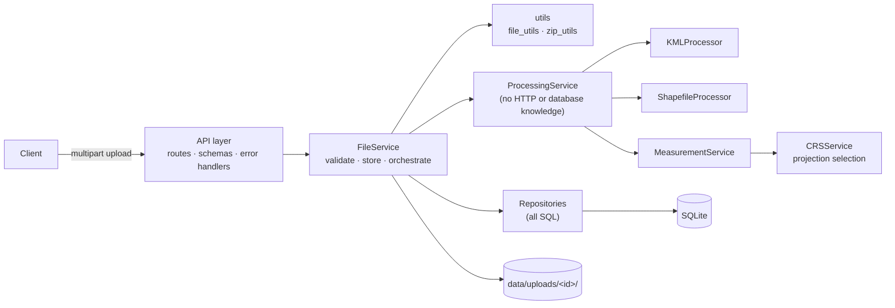
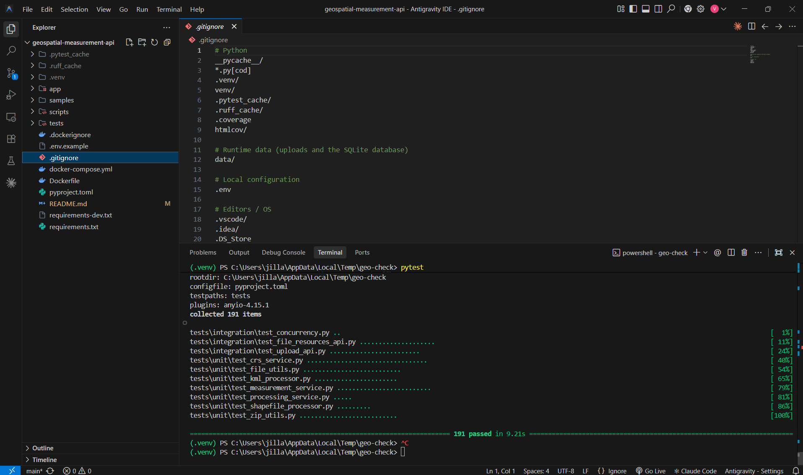
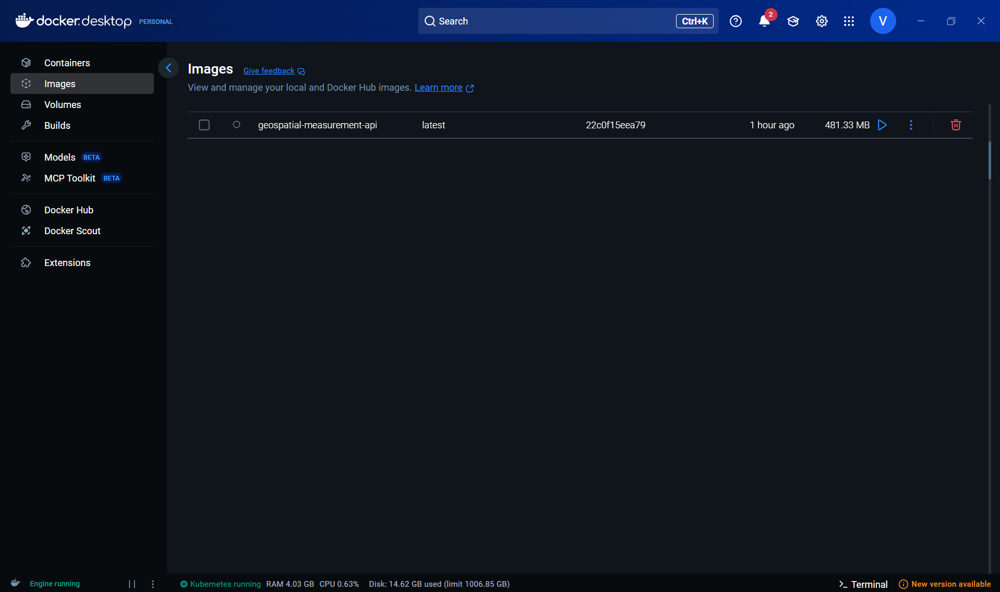

# Geospatial File Measurement API

This is a FastAPI service that accepts KML files and zipped Shapefiles, reads every
feature inside them, and returns area, perimeter and length measurements in metres. Each
measurement is calculated in a coordinate reference system (CRS) that suits the location
of that particular feature, so the numbers are correct on the ground.

```bash
curl -F "file=@samples/bengaluru_survey.kml" http://localhost:8000/api/files/
curl http://localhost:8000/api/files/<id>/measurements/
```

## Table of contents

- [Overview](#overview)
- [Problem Statement](#problem-statement)
- [Features](#features)
- [Technology Stack](#technology-stack)
- [Architecture](#architecture)
- [Project Structure](#project-structure)
- [How It Works](#how-it-works)
- [API Documentation](#api-documentation)
- [Local Setup](#local-setup)
- [Running Tests](#running-tests)
- [Docker Setup](#docker-setup)
- [Example Usage](#example-usage)
- [CRS Strategy](#crs-strategy)
- [Design Decisions](#design-decisions)
- [Trade-offs](#trade-offs)
- [Future Improvements](#future-improvements)
- [Testing](#testing)
- [Verification Results](#verification-results)
- [Assignment Notes](#assignment-notes)

## Overview

When you upload a geospatial file, the service does four things:

1. It treats the file as untrusted input and checks the type, the size, the safety of
   the archive and the safety of the XML.
2. It reads every feature into one common model that does not depend on the file format.
   Each feature has an index, a source ID, a geometry type, a GeoJSON geometry, a CRS
   and its properties.
3. It measures each feature in a projection chosen for where that feature is. It never
   measures in raw latitude and longitude degrees.
4. It saves the file record, the features and the measurements, and makes them available
   through a small REST API. Interactive documentation is available at `/docs` and
   `/redoc`.

A bad feature never brings down the whole upload. Every feature carries a measurement
status, which tells you whether it was measured and, if it was not, the reason.

## Problem Statement

The assignment was to build a backend service in Django or FastAPI that accepts a
Shapefile (as a `.zip`) or a KML file. For each feature, the service has to extract the
ID, geometry type, geometry, CRS and properties. It must calculate the area of polygons
and the length of lines, while points need no measurement. Geographic coordinates, such
as EPSG:4326, must be converted to a suitable projected CRS before measuring. The
required endpoints are `POST /api/files/`, `GET /api/files/{id}/` and
`GET /api/files/{id}/measurements/`.

## Features

- **Supported formats.** `.kml` files (KML 2.0, 2.1 and 2.2, with or without the
  namespace), and `.zip` files that contain one Shapefile. The Shapefile needs `.shp`,
  `.shx` and `.dbf`. The `.prj` and `.cpg` files are optional, and the files may sit
  inside nested folders.
- **Measurements.**
  - Polygons and MultiPolygons get an area in square metres and a perimeter in metres.
    The perimeter includes every ring, holes as well.
  - LineStrings and MultiLineStrings get a length in metres.
  - Points and MultiPoints are marked `NOT_APPLICABLE`.
- **CRS handling for each feature.**
  - The projected CRS of the file is used only when it is accurate at the place where
    the feature lies. Otherwise the feature is measured in its local UTM zone.
  - Very large features and polar features use an equal-area projection for area and
    geodesic calculations for length.
  - Features that cannot be measured reliably, such as those crossing the antimeridian
    or those with mislabelled coordinates, are rejected with a reason.
- **One bad feature does not fail the file.** A malformed, invalid or unsupported
  feature only affects itself.
- **Attributes are kept.** Shapefile attributes are converted to JSON types. For KML,
  `ExtendedData` (both `Data` and `SchemaData`) is kept, along with the name,
  description and folder path.
- **Upload security.**
  - Protection against zip slip, symbolic links, encrypted members and zip bombs.
  - Protection against XXE and entity expansion attacks in KML.
  - Size limits that are enforced while the upload is still streaming in.
  - File signature (magic byte) checks. Uploaded file names are never used as paths.
- **Consistent JSON errors** in the form `{"error": {"code", "message", "details"}}`.
  Error responses never contain stack traces or server paths.
- **Operational basics.** Structured `key=value` logs, an `X-Request-ID` header, a
  `/health` endpoint, and a Docker image that runs as a non-root user with a health
  check.
- **191 automated tests.** Measurement accuracy is checked against an independent
  ellipsoidal reference value.

## Technology Stack

| Area | Choice |
|---|---|
| Language | Python 3.12 |
| Web framework | FastAPI with Uvicorn, Pydantic v2, pydantic-settings |
| Geospatial | Shapely 2 for geometry, pyproj for CRS, transformations and geodesics, GeoPandas with pyogrio and GDAL for reading Shapefiles, defusedxml for KML |
| Database | SQLAlchemy 2 as the ORM, SQLite |
| Testing and code quality | pytest, httpx (through the Starlette TestClient), Ruff |
| Packaging | Docker (python:3.12-slim, non-root user), Docker Compose |

## Architecture



| Layer | What it does |
|---|---|
| `api/` | Thin route handlers, dependency wiring, and conversion from database objects to response schemas. It has no business logic and no SQL. |
| `services/file_service.py` | Handles the life of an upload and its status changes: `UPLOADED`, then `PROCESSING`, then `COMPLETED` or `FAILED`. |
| `services/processing_service.py` | A pure pipeline that parses the file, resolves the CRS and measures the features. It takes a file path and returns a result, so it can be moved to a background worker without any change. |
| `processors/` | One class for each format. All of them produce the same `ParsedDataset` and `ParsedFeature` model. |
| `services/crs_service.py`, `measurement_service.py` | Reading the CRS, choosing the projection, and measuring each feature and setting its status. |
| `db/` | Models and repositories. This is the only place that knows about SQL. |

## Project Structure

```
app/
├── main.py                    # app factory, middleware, exception handlers
├── api/
│   ├── deps.py                # dependency injection: session, FileService, pagination
│   ├── serializers.py         # database objects to response schemas
│   └── routes/
│       ├── files.py           # POST and GET files, GET features
│       └── measurements.py    # GET measurements
├── core/
│   ├── config.py              # settings (GEO_* environment variables)
│   ├── enums.py               # FileStatus, MeasurementStatus, MeasurementMethod and others
│   ├── exceptions.py          # AppError classes mapped to HTTP status and error code
│   ├── logging.py             # key=value log formatter
│   └── middleware.py          # streaming body size limit, request logging
├── db/
│   ├── database.py            # engine and session factory
│   ├── models.py              # GeoFile, Feature, Measurement
│   └── repositories.py        # all queries
├── processors/
│   ├── base.py                # ParsedFeature, ParsedDataset, GeospatialProcessor
│   ├── kml_processor.py
│   └── shapefile_processor.py
├── schemas/                   # Pydantic request and response models
├── services/
│   ├── crs_service.py
│   ├── file_service.py
│   ├── measurement_service.py
│   └── processing_service.py
└── utils/
    ├── file_utils.py          # file name cleaning, type detection, streaming save
    ├── geometry_utils.py      # geometry classification, GeoJSON and JSON-safe values
    └── zip_utils.py           # safe archive inspection and extraction
tests/
├── factories.py               # builds KML and Shapefile ZIP test files on the fly
├── unit/                      # 145 tests
└── integration/               # 46 API and concurrency tests
samples/                       # example files ready to upload
scripts/generate_samples.py    # regenerates the samples folder
docs/images/                   # screenshots used in this README
Dockerfile, docker-compose.yml, requirements.txt, requirements-dev.txt, pyproject.toml, .env.example
```

## How It Works

### Upload flow

1. **Size limit at the transport level.** `MaxBodySizeMiddleware` rejects a request
   whose `Content-Length` is above the limit, and it stops a streamed body as soon as it
   crosses the limit. This happens before Starlette writes the upload to disk, and the
   client gets a `413`.
2. **Request validation.** This is done before anything is saved, so a failed request
   leaves no record and no file behind.
   - The file name is cleaned for display only, and the type is detected from the
     extension.
   - The optional `assumed_crs` value is parsed. If it cannot be read, the client gets a
     `400`.
3. **Storage.** The file is streamed in 1 MB chunks to
   `data/uploads/<uuid>/source.kml` or `source.zip`, with a second size check. The path
   is built only from a UUID that the server generates.
4. **Content checks.** The file signature must match the extension (a ZIP signature or
   XML). For a ZIP file, the structure of the archive is inspected without extracting
   anything (see [Design Decisions](#design-decisions)). A problem here gives a `400`.
5. A `GeoFile` row is created with the status `UPLOADED`. Processing then runs straight
   away, in the same request, with the status `PROCESSING`.
6. **Result.**
   - If processing succeeds, the status becomes `COMPLETED` and the client gets a
     `201 Created` with a `Location` header.
   - If the content cannot be processed (malformed KML, an unreadable `.shp` or an
     invalid `.prj`), the record is marked `FAILED` with an `error_message`. The client
     gets a `422` with `error.details.file_id`, so the failure can still be looked at
     through `GET /api/files/{id}/`.

### Geospatial processing flow

1. The stored file is passed to the right processor, which returns a `ParsedDataset`
   holding the CRS, the list of features and any warnings.
2. The CRS is resolved. The CRS declared in the file always wins. `assumed_crs` is used
   only to fill a gap when the file declares nothing.
3. `MeasurementService.measure()` runs on each feature.
4. Each feature is saved with its GeoJSON geometry, its properties and its status, along
   with its measurement rows.

**KML.** The file is parsed with `defusedxml`. Placemarks are collected from every
`Document` and `Folder`, and each feature remembers the folder path it came from.

- The supported geometries are `Point`, `LineString`, `LinearRing`, `Polygon` (holes
  included) and `MultiGeometry`. A `MultiGeometry` becomes the matching Multi type when
  all its parts are the same type, and a `GeometryCollection` otherwise.
- `Model` and `gx:Track` are marked as unsupported instead of being dropped quietly.
- A malformed coordinate affects only the feature it belongs to.
- The CRS is always EPSG:4326, because the KML specification defines it that way.

**Shapefile.** The ZIP is extracted safely into a private temporary folder using fixed
names such as `layer.shp`, and then read with GeoPandas and pyogrio.

- The CRS is read from the `.prj` file with pyproj. This lets the service tell a
  missing CRS apart from an invalid one.
  - **Missing CRS:** the file completes, the features are marked `UNKNOWN_CRS`, and a
    warning suggests sending `assumed_crs`.
  - **Invalid CRS:** the file is marked `FAILED` and the client gets
    `422 INVALID_CRS`.
- Attribute values such as NaN, dates and NumPy types are converted to plain JSON.

### Measurement flow

For each feature, the checks below run in order, and the first one that matches decides
the status.

| Check | Status |
|---|---|
| The geometry could not be decoded | `INVALID_GEOMETRY`, with the parser message |
| There is no geometry, or it is empty | `EMPTY_GEOMETRY` |
| The type is declared but not supported, such as KML `Model` or `gx:Track` | `UNSUPPORTED_GEOMETRY` |
| Point or MultiPoint | `NOT_APPLICABLE` |
| GeometryCollection with mixed dimensions | `UNSUPPORTED_GEOMETRY` |
| Shapely reports the geometry as invalid, for example a self-intersection | `INVALID_GEOMETRY`, with the reason from `is_valid_reason` |
| The CRS of the file is unknown | `UNKNOWN_CRS` |
| The feature crosses the antimeridian, or its coordinates are out of range | `FAILED`, with the reason |
| None of the above | `MEASURED` |

Measured polygons get an `area` in square metres and a `perimeter` in metres. Lines get a
`length` in metres. Every value records the method used and the CRS it was calculated
in. Z values (heights) are ignored, so all measurements are flat (planimetric). Values
are rounded to the nearest millimetre.

### CRS handling

This is a short summary. The full explanation is in [CRS Strategy](#crs-strategy).

1. Find the CRS. For KML it is EPSG:4326. For a Shapefile it comes from the `.prj` file,
   with `assumed_crs` as an optional fallback.
2. Use only the horizontal part of the CRS. Compound CRSs such as `EPSG:4326+5773` are
   handled.
3. Choose a measurement CRS for each feature. The original CRS is kept on the file and
   on every feature, and both CRSs are shown in the measurement output.

## API Documentation

Interactive documentation is available at **http://localhost:8000/docs** (Swagger UI)
and at **/redoc**.

All paths end with a slash, as in the assignment (`/api/files/`). A request without the
slash gets a `307` redirect to the correct path. With curl, please include the trailing
slash or pass `-L`.

Every error uses the same structure:

```json
{ "error": { "code": "INVALID_ARCHIVE", "message": "Shapefile 'roads' is missing required component(s): .dbf.", "details": {} } }
```

| Code | HTTP status | When it happens |
|---|---|---|
| `UNSUPPORTED_FILE_TYPE` | 400 | The extension is not `.kml` or `.zip` |
| `INVALID_UPLOAD` | 400 | The file is empty, or its content does not match the extension |
| `INVALID_ARCHIVE` | 400 | Not a ZIP file, unsafe paths, symbolic links, encryption, a zip bomb, or no Shapefile, more than one Shapefile or an incomplete Shapefile |
| `INVALID_CRS` | 400 or 422 | `assumed_crs` cannot be read (400), or the `.prj` content is invalid (422) |
| `NOT_FOUND` | 404 | The file ID does not exist |
| `FILE_NOT_PROCESSED` | 409 | Features or measurements were requested for a file that is not `COMPLETED` |
| `FILE_TOO_LARGE` | 413 | The upload is bigger than `GEO_MAX_UPLOAD_BYTES` (50 MB by default) |
| `PROCESSING_FAILED` | 422 | The file was accepted but its content could not be processed. `details.file_id` points to the `FAILED` record. |
| `VALIDATION_ERROR` | 422 | A form field is missing, or a query parameter is wrong |
| `INTERNAL_ERROR` | 500 | An unexpected error. The details are written only to the server log. |

### Upload and process a file: `POST /api/files/`

- **Request:** `multipart/form-data` with these fields.
  - `file` (required): a `.kml` file, or a `.zip` file containing exactly one Shapefile.
  - `assumed_crs` (optional): for example `EPSG:4326`, or any value that pyproj can
    read. It is used only when the file declares no CRS. If the file already has a CRS
    and the value conflicts with it, the value is ignored and a warning is added.
- **Response:** `201 Created`, with `Location: /api/files/{id}/`

```bash
curl -F "file=@samples/bengaluru_survey.kml" http://localhost:8000/api/files/
```

```json
{
  "id": "8627ad32a050459fa35736d101ed51bb",
  "filename": "bengaluru_survey.kml",
  "file_type": "KML",
  "size_bytes": 1371,
  "status": "COMPLETED",
  "feature_count": 4,
  "crs": "EPSG:4326",
  "crs_name": "WGS 84",
  "warnings": [],
  "error_message": null,
  "processing_time_ms": 59,
  "created_at": "2026-10-07T10:50:53.469038Z",
  "processed_at": "2026-10-07T10:50:53.545182Z",
  "links": {
    "self": "/api/files/8627ad32a050459fa35736d101ed51bb/",
    "features": "/api/files/8627ad32a050459fa35736d101ed51bb/features/",
    "measurements": "/api/files/8627ad32a050459fa35736d101ed51bb/measurements/"
  }
}
```

- **Errors:** 400, 413 and 422 (see the table above).

### File information: `GET /api/files/{id}/`

This returns the same structure as the upload response. It also works for files that
failed, in which case `status` is `"FAILED"` and `error_message` is filled in.
**Errors:** 404.

```bash
curl http://localhost:8000/api/files/8627ad32a050459fa35736d101ed51bb/
```

### Measurements: `GET /api/files/{id}/measurements/`

- **Query parameters:** `limit` (from 1 to 1000, default 100) and `offset` (0 or more).
- `summary` always covers the whole file, while `items` holds only the requested page.
- **Errors:** 404, 409 (the file is not `COMPLETED`) and 422 (wrong pagination values).

```bash
curl "http://localhost:8000/api/files/8627ad32a050459fa35736d101ed51bb/measurements/"
```

```json
{
  "total": 4, "limit": 100, "offset": 0,
  "file_id": "8627ad32a050459fa35736d101ed51bb",
  "source_crs": "EPSG:4326",
  "summary": {
    "feature_count": 4,
    "status_counts": { "MEASURED": 3, "NOT_APPLICABLE": 1, "UNSUPPORTED_GEOMETRY": 0, "INVALID_GEOMETRY": 0, "EMPTY_GEOMETRY": 0, "UNKNOWN_CRS": 0, "FAILED": 0 },
    "total_area_m2": 1712472.239,
    "total_length_m": 1307.412
  },
  "items": [
    {
      "feature_index": 0, "source_id": "lalbagh", "geometry_type": "Polygon",
      "status": "MEASURED", "message": null,
      "measurements": [
        { "type": "area", "value": 847260.471, "unit": "m²", "method": "UTM", "measurement_crs": "EPSG:32643" },
        { "type": "perimeter", "value": 3560.337, "unit": "m", "method": "UTM", "measurement_crs": "EPSG:32643" }
      ]
    },
    {
      "feature_index": 2, "source_id": "mg-road", "geometry_type": "LineString",
      "status": "MEASURED", "message": null,
      "measurements": [
        { "type": "length", "value": 1307.412, "unit": "m", "method": "UTM", "measurement_crs": "EPSG:32643" }
      ]
    },
    {
      "feature_index": 3, "source_id": "survey-marker", "geometry_type": "Point",
      "status": "NOT_APPLICABLE", "message": "Points have no area or length.", "measurements": []
    }
  ]
}
```

Item 1 (Cubbon Park) is left out above to keep the example short.

- `method` is one of `SOURCE_PROJECTED`, `UTM`, `LOCAL_EQUAL_AREA` or `GEODESIC`.
- `status` is one of `MEASURED`, `NOT_APPLICABLE`, `UNSUPPORTED_GEOMETRY`,
  `INVALID_GEOMETRY`, `EMPTY_GEOMETRY`, `UNKNOWN_CRS` or `FAILED`.

### Extracted features: `GET /api/files/{id}/features/`

This endpoint returns everything the assignment asks for about each feature: the index,
the source ID, the geometry type, the geometry (as GeoJSON, in the source CRS), the CRS
and the properties. It is paginated in the same way as the measurements endpoint.
**Errors:** 404, 409 and 422.

```bash
curl "http://localhost:8000/api/files/8627ad32a050459fa35736d101ed51bb/features/?limit=1"
```

```json
{
  "total": 4, "limit": 1, "offset": 0,
  "file_id": "8627ad32a050459fa35736d101ed51bb", "crs": "EPSG:4326",
  "items": [{
    "index": 0, "source_id": "lalbagh", "geometry_type": "Polygon",
    "geometry": { "type": "Polygon", "coordinates": [[[77.58, 12.953], [77.589, 12.953], [77.5905, 12.948], [77.585, 12.9445], [77.5795, 12.9475], [77.58, 12.953]]] },
    "crs": "EPSG:4326",
    "properties": { "name": "Lalbagh Botanical Garden", "folder": "Bengaluru survey/Parks", "category": "botanical garden", "surveyed_by": "Team A" }
  }]
}
```

### List of uploads: `GET /api/files/`

This lists uploads with the newest first, and it is paginated with `limit` and `offset`.
`GET /health` returns `{"status": "ok"}`.

## Local Setup

You need **Python 3.12 or newer**. You do not need to install GDAL, GEOS or PROJ on your
system, because the Python wheels already include them.

On macOS or Linux:

```bash
git clone https://github.com/code-with-vishnu26/geospatial-measurement-api.git geospatial-measurement-api
cd geospatial-measurement-api
python3.12 -m venv .venv
source .venv/bin/activate
pip install -r requirements-dev.txt          # or requirements.txt if you only want to run the app
cp .env.example .env                         # optional, the defaults work as they are
uvicorn app.main:create_app --factory --reload
```

On Windows (PowerShell):

```powershell
git clone https://github.com/code-with-vishnu26/geospatial-measurement-api.git geospatial-measurement-api
cd geospatial-measurement-api
py -3.12 -m venv .venv
.venv\Scripts\Activate.ps1
pip install -r requirements-dev.txt
uvicorn app.main:create_app --factory --reload
```

Then open http://localhost:8000/docs. Uploaded files and the SQLite database are saved
in `./data/`, which you can change with `GEO_DATA_DIR`. All the settings are listed in
[.env.example](.env.example).

## Running Tests

```bash
pip install -r requirements-dev.txt
pytest                      # all 191 tests, about 11 seconds
pytest tests/unit           # 145 unit tests
pytest tests/integration    # 46 API and concurrency tests
ruff check . && ruff format --check .
```

The tests create their own KML and Shapefile test files in temporary folders. They do
not need a network connection, any outside service or any binary files stored in the
repository.

## Docker Setup

```bash
docker build -t geospatial-measurement-api .
docker run --rm -p 8000:8000 -v geo-data:/app/data geospatial-measurement-api
```

You can also use Docker Compose, which uses a named volume for the data and picks up an
optional `.env` file:

```bash
docker compose up --build
```

About the image:

- It is based on `python:3.12-slim` and runs as the unprivileged user `appuser`
  (user ID 10001).
- It has a `HEALTHCHECK` that calls `/health`, and the data lives in the `/app/data`
  volume.
- It needs no system geospatial packages, since GDAL, GEOS and PROJ come with the Python
  wheels.

## Example Usage

Ready-made files are in the [`samples/`](samples/) folder, and all of them are located in
Bengaluru. You can regenerate them with `python scripts/generate_samples.py`.

```bash
# 1. KML with polygons, a line and a point, in WGS 84
curl -F "file=@samples/bengaluru_survey.kml" http://localhost:8000/api/files/

# 2. Shapefile ZIP in WGS 84, measured in UTM zone 43N
curl -F "file=@samples/bengaluru_parks_wgs84.zip" http://localhost:8000/api/files/

# 3. The same parks as a Shapefile already in UTM zone 43N, measured in its own CRS
curl -F "file=@samples/bengaluru_parks_utm43n.zip" http://localhost:8000/api/files/

# 4. A Shapefile without a .prj file, telling the service which CRS to assume
curl -F "file=@parcels_without_prj.zip" -F "assumed_crs=EPSG:4326" http://localhost:8000/api/files/

# File details, features and measurements
curl http://localhost:8000/api/files/<id>/
curl "http://localhost:8000/api/files/<id>/features/?limit=10"
curl http://localhost:8000/api/files/<id>/measurements/
```

Samples 2 and 3 make a good sanity check. They contain the same parks in two different
CRSs, measured by two different methods (`UTM` and `SOURCE_PROJECTED`), and they give
exactly the same results: Lalbagh is **847,260.471 m²** and Cubbon Park is
**865,211.768 m²**.

## CRS Strategy

### Why latitude and longitude cannot be measured directly

A degree is not a fixed distance. One degree of longitude is about 111 km at the
equator, about 56 km at 60° latitude, and zero at the poles. If you call `polygon.area`
on EPSG:4326 coordinates, you get "square degrees". That number has no real meaning,
and its relation to square metres changes with latitude. For the 1.1 km Bengaluru block
used in the tests, it comes out as `0.0001`. So the geometry must first be moved into a
CRS whose units are metres and whose distortion is small at the place where the feature
lies.

### How the measurement CRS is chosen for each feature

The service works out the bounding box of the feature in WGS 84 longitude and latitude,
and then goes through these steps in order.

1. **Reject what cannot be measured safely.**
   - If the box spans more than 180° or crosses the antimeridian, the feature is marked
     `FAILED`.
   - If geographic coordinates fall outside ±180° longitude or ±90° latitude, the
     feature is marked `FAILED` with a note that the CRS is probably wrong.
2. **Use the CRS of the file if it is accurate here.** If the source CRS is projected
   and its scale distortion stays within 0.5% over the whole box, the feature is
   measured in it (`SOURCE_PROJECTED`), and the units are converted to metres.
3. **Otherwise, use the local UTM zone.** The zone is chosen from the centre of the box.
   It is used if the feature lies between 80°S and 84°N and the distortion stays within
   0.5% (`UTM`, EPSG:326xx in the north or EPSG:327xx in the south).
4. **For continental scale or polar features, use exact methods.**
   - Area is calculated in a Lambert Azimuthal Equal-Area projection centred on the
     feature (`LOCAL_EQUAL_AREA`).
   - Length and perimeter are calculated as geodesics on the WGS 84 ellipsoid with
     `pyproj.Geod` (`GEODESIC`).

"Distortion" here is measured, not assumed. `pyproj.Proj.get_factors` gives the areal,
meridional and parallel scale factors at the four corners and the centre of the box, and
every one of them must lie within `1 ± GEO_MAX_SCALE_DISTORTION` (the default is
`0.005`).

### Why I chose this approach

- **A projected CRS is not automatically safe to measure in.** Web Mercator makes areas
  look 4 times bigger at 60°N, and a UTM zone used far from its central meridian can be
  off by several percent. Checking the actual distortion catches these cases in a
  general way, without a hard-coded list of EPSG codes to block.
- **UTM is the standard choice for local features, and anyone can check it.** It has
  EPSG codes and gives the same answers in QGIS. The zone is chosen from the bounding
  box of each feature, not once per file and not as one CRS for the whole world, so
  features in different regions all stay accurate. When the file's own CRS is accurate,
  the service measures in it, which respects surveyed national grids, including ones
  that use feet. Units are converted using the unit factor of the CRS axis.
- **No single projection keeps both area and long distances correct.** For features that
  are too big for UTM, area uses an equal-area projection centred on the feature, which
  is exact at any size. Lengths use ellipsoidal geodesics, which are the true values that
  projections only approximate.
- **It fails clearly instead of guessing.** A missing CRS is never assumed to be
  EPSG:4326. Data that crosses the antimeridian or is mislabelled gets an explanation,
  not a wrong number that looks believable.

### Measured accuracy against ellipsoidal geodesic reference values

| Case | Input CRS | Method used | Reference value | Result | Error |
|---|---|---|---|---|---|
| 1.1 km block in Bengaluru (area, m²) | EPSG:4326 | UTM 43N | 1,200,290 | 1,201,684 | +0.116% |
| 2.6 km road in Bengaluru (length, m) | EPSG:4326 | UTM 43N | 2,634 | 2,636 | +0.058% |
| 0.6 km² parcel in Norway (area, m²). Measuring directly in Web Mercator would give 2,478,781, which is 299% too high. | EPSG:3857 | UTM 32N | 621,587 | 621,138 | -0.072% |
| Circle of radius 1,500 km in Europe (area, m²) | EPSG:4326 | LAEA | 7.036013e12 | 7.036010e12 | -0.00005% |
| London to Moscow (length, m) | EPSG:4326 | Geodesic | 2,508,569 | 2,508,569 | Same value, since it is the same method |

The small error left in UTM, about 0.1%, comes from the scale factor of UTM itself. The
scale is 0.9996 on the central meridian and about 1.001 at the edge of a zone. If you
need tighter accuracy, set `GEO_MAX_SCALE_DISTORTION=0.001`. Features where UTM is less
accurate than that will then switch automatically to the exact equal-area and geodesic
methods.

### Limitations

- **How edges are treated.** Every vertex is transformed exactly, but each edge is
  treated as a straight line in the measurement projection. For features that are
  hundreds of kilometres wide, an edge that is straight in longitude and latitude, a
  rhumb line and a geodesic all enclose different areas. That uncertainty is in the data
  itself, not in the projection. Adding extra points along edges (densification) is
  listed under future work.
- **Geometries that cross the antimeridian or cover the globe** are reported as `FAILED`
  instead of being split automatically.
- **Longitudes must be between -180 and 180.** Geographic data that uses 0 to 360 is
  reported as `FAILED` (out of range) instead of being shifted quietly.
- **Flat measurements only.** Z values are ignored, so there is no slope, no 3D surface
  area and no use of ellipsoidal heights.
- **Distortion is checked at 5 points**, the four corners and the centre of the bounding
  box, not across the whole feature. For areas the size of a feature, in UTM and in
  common conic or national grids, the scale changes smoothly and the extreme values fall
  at or near these points. It is still an approximation.
- The UTM zone choice ignores the special zone rules for Norway and Svalbard. Those rules
  matter for map sheet conventions, not for measurement accuracy, which the distortion
  check already takes care of.

## Design Decisions

| Decision | Reason | Other options I considered |
|---|---|---|
| **FastAPI** | Typed request and response models, automatic OpenAPI documentation, and simple dependency injection. The task is an API, not a content management system. | Django with Django REST Framework. Its admin and migrations are useful, but this project would not use them. |
| **Synchronous processing, with a pipeline ready for workers** | Easy to run and to review. Typical survey files are processed in milliseconds, and the full flow of parsing, measuring and saving handled about 3,000 to 5,500 features per second. `ProcessingService` has no link to HTTP or the database, so moving it to a Celery, RQ or Arq worker only means changing the code that calls it. | Background tasks with `202 Accepted` right now. That adds a queue and polling without any need at this scale. |
| **Measure once at upload and store the results** | The GET endpoints become cheap reads, and the results can be reproduced and audited, since the method and CRS are stored with every value. | Calculating on every GET. That is wasteful and would mean parsing the file again each time. |
| **A measurement CRS for each feature** | A file can cover several regions or UTM zones. One CRS for the whole file would quietly reduce accuracy for features far from the centre. | One UTM zone per file, or one global equal-area CRS (exact area, but poor lengths). |
| **Accepting a CRS based on measured distortion** | One rule answers both questions: "is the source CRS good enough?" and "is this UTM zone good enough?". It relies on the maths built into PROJ. | Hard-coded lists of allowed and blocked EPSG codes, or a fixed buffer of a few degrees around each zone. I tried the buffer first and replaced it, because it was arbitrary and less accurate. |
| **My own KML parser built on defusedxml** | The KML driver that comes with GDAL drops `ExtendedData` (LIBKML is not in the wheels), which would lose attributes without any warning. defusedxml also blocks XXE and "billion laughs" attacks. | `geopandas.read_file(driver="KML")`, fastkml, lxml. |
| **GeoPandas with pyogrio for Shapefiles** | A well-tested GDAL reader that is vectorised and fast. pyogrio is the default engine in GeoPandas, so Fiona is not needed as an extra dependency. | Fiona, which can do the same but is slower and adds a dependency, or pyshp, which is pure Python but weaker at handling CRS and encodings. |
| **Reading the CRS from `.prj` with pyproj instead of GDAL** | This lets the API tell a missing CRS (warn and mark the features `UNKNOWN_CRS`) from an invalid one (fail with a clear error). GDAL treats both as "no CRS". | Trusting `GeoDataFrame.crs`. |
| **Never assuming EPSG:4326, and offering an explicit `assumed_crs`** | Guessing gives confident but wrong numbers. Making the assumption explicit puts it on record as a warning on the file. | Defaulting to EPSG:4326, or guessing from the coordinate ranges. |
| **A status for each feature instead of failing the file** | One bad Placemark should not throw away 10,000 good ones, and every skipped feature has a reason that the client can show. | Failing the whole request, or skipping bad features without saying anything. |
| **4xx errors before saving, and `422` with a `FAILED` record after saving** | Request errors leave no rubbish behind, while content errors can still be inspected through the status model. | Always returning `201` with `status: FAILED`, which confuses clients, or never saving failures, which leaves no audit trail. |
| **Streaming size limit in ASGI middleware** | Starlette writes multipart bodies to disk before the endpoint runs, so a check only inside the endpoint would still let a client fill up the disk. | Relying only on a reverse proxy. That is still recommended in production, as mentioned below. |
| **Archive safety by design** | Archive members are written to fixed names in a private temporary folder, so their paths never reach the file system. Unsafe names are still rejected, because they suggest a malicious archive. Size budgets are enforced on the actual decompressed bytes. | `ZipFile.extractall` followed by path checks. |
| **Bulk inserts for features and measurements** | Profiling showed that creating one ORM object per row made saving about 70% of the upload time, and it grew faster than the number of features. Bulk `INSERT ... RETURNING` keeps the speed steady at about 3,000 features per second from 20,000 up to 100,000 features. | ORM `add_all`, which is simpler but 2 to 3 times slower at scale. |
| **GeoJSON stored in a JSON column on SQLite** | It runs locally with no setup. The repository layer is the only code that touches storage, so moving to PostGIS geometry columns would be a contained change. | SpatiaLite or PostGIS now. That means extra setup for reviewers with no benefit at this scale. |
| **Random UUIDs as IDs** | They cannot be guessed in sequence, they are safe to expose, and they need no coordination. | Auto-increment integers. |
| **`create_all` instead of Alembic** | There is only one schema so far, so migrations would be unnecessary at this point. | Alembic, which is the first thing to add once the schema starts changing. |

## Trade-offs

- **Synchronous uploads keep a worker busy** while the file is processed. That is fine
  for survey sized files, but at the limit of 100,000 features (a 33 MB KML), an upload
  took about 33 seconds in local benchmarks. Moving processing to the background is the
  first step towards scaling.
- **SQLite handles one write at a time.** The database runs in WAL mode with a 30 second
  busy timeout, so concurrent uploads wait for the write lock instead of failing. In a
  load test, 8 parallel uploads of 15,000 features each all succeeded. Throughput does
  not grow with more writers, which is fine for local use but not for a multi-user
  deployment.
- **The whole KML document is kept in memory**, limited by the 50 MB upload limit.
  Parsing with a streaming `iterparse` would lower the peak memory for very large files.
- **One Shapefile per ZIP.** An archive with several layers is rejected with a clear
  message instead of the service guessing which layer to use.
- **Geometries are returned in the source CRS**, since the assignment asks for the CRS
  next to each feature. Strict GeoJSON (RFC 7946) requires WGS 84, and an output option
  such as `?crs=EPSG:4326` would cover both needs.
- **Original uploads are kept** in `data/uploads/<id>/` for auditing and reprocessing.
  There is no retention policy or delete endpoint yet.
- **No authentication.** This was outside the scope of the assignment, so every file is
  visible to every caller.

## Future Improvements

- **PostgreSQL with PostGIS:** native geometry columns, spatial indexes, cross-checks on
  the server with `ST_Area(geography)`, and Alembic migrations.
- **Background processing:** run `ProcessingService` in background workers (Celery, RQ
  or Arq with Redis), return `202 Accepted`, and let clients poll the existing status
  model, with retries and a dead letter queue.
- **Object storage** such as S3 or Google Cloud Storage for uploads, with presigned URLs
  so large files can go straight to the bucket.
- **Authentication and authorisation:** API keys or OAuth2 with JWT, file ownership for
  each tenant, and rate limiting.
- **Larger files:** streaming KML parsing, saving features in chunks, batch inserts, and
  keyset pagination instead of offset pagination.
- **More formats:** KMZ, GeoJSON, GeoPackage and archives with several layers. Each one
  is just a new `GeospatialProcessor`.
- **Measurement options:** geodesic densification of edges, an optional `make_valid`
  repair, hectares and acres, 3D surface area from Z values or an elevation model, and
  reprojection of the output.
- **Caching:** HTTP `ETag` headers (results never change once a file is `COMPLETED`),
  and Redis for frequently requested reports.
- **Observability:** JSON logs linked by request ID, Prometheus metrics for processing
  time and failure rates, OpenTelemetry tracing, and error tracking.
- **Deployment:** a reverse proxy that enforces body size limits
  (`client_max_body_size`), a CI pipeline for linting, tests and image scanning, and
  container orchestration with health and readiness probes.

## Testing

There are **191 tests**: 145 unit tests and 46 integration tests. They all pass locally
in about 11 seconds.

The main idea is that **measurements are checked against an independent reference**,
namely the ellipsoidal geodesic area and length from `pyproj.Geod`, and not against
numbers that the implementation itself produced.

| Area | What is covered |
|---|---|
| CRS selection (32 tests) | UTM zones in both hemispheres and at the ±180° edge, features on zone boundaries, native projected CRSs, US foot units, Web Mercator rejected, UTM coordinates outside their zone corrected, fallbacks for continental and polar features, the antimeridian (for both geographic and projected sources), mislabelled coordinates, units other than degrees (grads), NAD83, compound CRSs and ESRI WKT, invalid and geocentric CRS strings |
| Measurement (25 tests) | Polygon area and perimeter and line length within tolerance of the geodesic reference, proof that area in degrees is not used, holes (in area and in the geodesic perimeter), multi-geometries, an exact 100 m square in UTM, feet to metres, the 4 times Web Mercator distortion corrected, the equal-area fallback within 0.05%, geodesic lines, Z values ignored, and every status other than measured along with its reason |
| KML (22 tests) | Types, IDs, folders, `ExtendedData` and `SchemaData`, keeping both values when keys collide, holes, altitude, MultiGeometry types, malformed features kept isolated, `lon, lat` with a space and mixed 2D and 3D coordinates, document order, UTF-16, unsupported elements, KML without a namespace, malformed XML, **XXE and entity expansion attacks**, **5,000 levels of hostile nesting** (with no stack overflow), the feature limit |
| Shapefile (9 tests) | Attributes and type conversion, null geometries, projected CRS, nested folders, a missing `.prj` compared with an invalid one, a corrupt `.shp` without leaking paths, an empty layer, and the feature limit checked before any data is loaded |
| Archive security (26 tests) | Different kinds of path traversal (`../`, `..\`, absolute paths, UNC paths, drive letters), symbolic links, member count, zip bomb compression ratio, total size, missing, mismatched and multiple components, macOS metadata files, extraction to fixed names |
| Upload utilities (26 tests) | File name cleaning, extension and file signature checks, the streaming size limit with cleanup, empty files |
| API and concurrency (46 tests) | All endpoints, valid KML and Shapefile ZIP, a projected Shapefile, a missing CRS with and without `assumed_crs`, an invalid `.prj`, invalid file type and content, a malformed ZIP, missing components, zip slip, malformed KML giving a `FAILED` record, 404, 409 and 422 responses, **413 through `Content-Length`, through a chunked stream and through the check inside the endpoint**, pagination, no server paths in errors, an unexpected crash giving a generic 500 and a `FAILED` record, timestamps with time zones, identical results for the same geometry from KML and from a Shapefile, the SQLite WAL and busy timeout settings, and 6 parallel uploads that all succeed |

## Verification Results

I ran these checks before submitting, on 7 October 2026.

| Check | How it was done | Result |
|---|---|---|
| Fresh clone of this repository | `git clone`, then a new virtual environment, then `pip install -r requirements-dev.txt`, then `pytest` | **191 passed in 9.21 seconds** (Windows 11, Python 3.12.10, pytest 9.1.1) |
| Unit tests | `pytest tests/unit` | 145 passed |
| Integration tests | `pytest tests/integration` | 46 passed |
| Linting and formatting | `ruff check .` and `ruff format --check .` | No issues |
| Sample files | Uploaded all three files in [samples/](samples/), both locally and in Docker | All `COMPLETED` |
| Concurrent uploads | 8 parallel uploads against a running uvicorn server | All 8 succeeded, with no `database is locked` errors |
| Hostile input | KML nested 5,000 levels deep, and UTF-16 KML, against a running server | Processed without errors |
| Docker | `docker compose up --build` | The container reports `healthy`, runs as the non-root user `appuser`, and SQLite runs in WAL mode |

The fresh clone run shows three things: the repository contains every file the tests
need, `requirements-dev.txt` is complete, and the steps in [Local Setup](#local-setup)
work exactly as written.



The built Docker image (`geospatial-measurement-api:latest`, 481 MB) in Docker Desktop:



Output of the fresh clone test run:

```text
platform win32 -- Python 3.12.10, pytest-9.1.1, pluggy-1.6.0
configfile: pyproject.toml
testpaths: tests
plugins: anyio-4.15.1
collected 191 items

tests\integration\test_concurrency.py ..                                    [  1%]
tests\integration\test_file_resources_api.py ....................           [ 11%]
tests\integration\test_upload_api.py ........................               [ 24%]
tests\unit\test_crs_service.py ................................             [ 40%]
tests\unit\test_file_utils.py ..........................                    [ 54%]
tests\unit\test_kml_processor.py ......................                     [ 65%]
tests\unit\test_measurement_service.py .........................            [ 79%]
tests\unit\test_processing_service.py .....                                 [ 81%]
tests\unit\test_shapefile_processor.py .........                            [ 86%]
tests\unit\test_zip_utils.py ..........................                     [100%]

191 passed in 9.21s
```

## Assignment Notes

### What I learned

- **A projected CRS is not the same as a measurable one.** I started with the usual
  rule of converting everything to UTM, and then compared the results with geodesic
  reference values. That showed my first rule, which used a fixed buffer around each
  zone, allowed area errors of up to about 0.5%. It also showed that projected inputs
  such as Web Mercator would have been trusted blindly. Measuring the distortion with
  the scale factors from PROJ gave me one sound rule for both cases.
- **The reference calculations in tests need care too.** One test failed because
  `pyproj.Geod` adds up signed ring areas, so holes must run in the opposite direction
  to the outer ring. The implementation was right, and my reference calculation was
  wrong. An independent reference only helps if it is correct itself.
- **Measure before making claims about performance.** A benchmark with 20,000 features
  showed that saving through the ORM slowed down faster than the data grew. Profiling
  pointed straight at it, and bulk inserts made the speed grow in a straight line with
  the data.
- **A final review with deliberately difficult inputs found more problems than the
  normal tests did.** Trying edge cases one at a time showed these problems:
  - SQLite gave "database is locked" under 8 parallel uploads, and 3 of the 8 got a 500
    error.
  - Deeply nested KML overflowed the recursion stack.
  - `pyproj.Geod.geometry_length` quietly ignores polygon holes, so the geodesic and
    projected perimeters did not match.
  - A range check that assumed degrees rejected valid CRSs measured in grads.

  Each of these now has a regression test.
- **Format details matter.** A Shapefile layer holds only one geometry type. The KML
  driver in GDAL drops `ExtendedData`. A missing `.prj` and a corrupt `.prj` look the
  same through GDAL. SQLite quietly drops time zones, which a test caught and a UTC-aware
  column type fixed.
- **Upload security has to work at several layers.** Starlette buffers multipart bodies
  before the endpoint runs, so a correct 413 needs to be enforced at the ASGI level. Zip
  safety also has to count the actual decompressed bytes instead of trusting the archive
  header.

### What I would improve with more time

- Background processing with `202 Accepted`, and PostGIS for storage and spatial
  queries.
- Geodesic densification of edges for very large polygons, and an optional mode that
  repairs invalid geometry.
- Processors for KMZ, GeoJSON and GeoPackage, and support for archives with several
  layers.
- Property-based tests with Hypothesis that check random geometries and CRSs against
  geodesic reference values, and a performance test with a 100,000-feature file.
- Authentication, a delete endpoint that also cleans up storage, and a retention policy.
